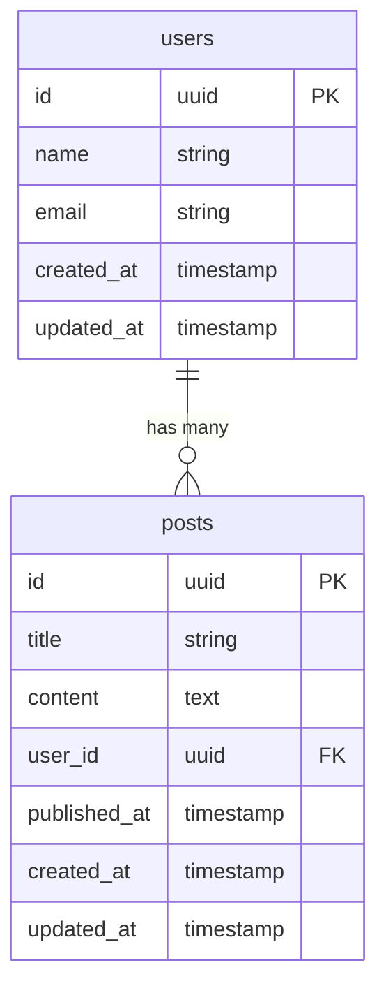

README を更新して、Loco Framework（Rust の Rails ライクなフレームワーク）での使用を想定していることを明記しました。

## 🔄 追加した主な内容

**Loco Framework 関連の情報:**

- プロジェクト概要に Loco Framework での使用想定を明記
- 主な機能に Loco Framework 統合を追加
- Loco 専用のセクションを新設し、典型的なワークフローを説明
- Loco プロジェクト構造との互換性を図示
- 謝辞に Loco Framework を追加

**実用的なワークフロー:**

# 🔱 Triton

[](https://opensource.org/licenses/MIT)
[](https://www.rust-lang.org/)
[]()

**Triton** は、Mermaid 形式で記述された Entity-Relationship Diagram (ER 図) を解析し、SeaORM マイグレーションファイルの生成・管理を行う強力な CLI ツールです。特に **Loco Framework**（Rust の Rails ライクな Web フレームワーク）での開発を想定して設計されており、データベーススキーマ設計から実装まで、モダンな Rust Web 開発のワークフローを大幅に効率化します。

## ✨ 主な機能

- 🎨 **Mermaid ER → SeaORM マイグレーション変換**: Mermaid 形式の ER 図から SeaORM マイグレーションファイルを自動生成
- 🚂 **Loco Framework 統合**: Loco（Rust の Rails ライク）プロジェクトでの使用に最適化
- 🔧 **マイグレーション管理**: 既存のマイグレーションファイルに対するカラムの追加・削除
- 📊 **スキーマ可視化**: マイグレーションファイルの内容をわかりやすく表示
- 🚀 **直感的な CLI**: clap ベースの使いやすいコマンドライン体験
- 🛡️ **堅牢なエラーハンドリング**: 詳細なエラーメッセージと視覚的フィードバック

## 🚀 インストール

### Cargo 経由でのインストール

```bash
cargo install triton
```

### ソースからのビルド

```bash
git clone https://github.com/UtakataKyosui/Triton.git
cd Triton
cargo build --release
```

## 📖 使用方法

### 基本的な使用方法

Triton は複数のサブコマンドを提供し、それぞれが特定の機能を担当します：

```bash
triton --help
```

### 🎨 Generate コマンド - Mermaid ER からマイグレーション生成

Mermaid 形式の ER 図から SeaORM マイグレーションファイルを生成します。Loco Framework プロジェクトでの使用を想定しており、`src/migrations/` ディレクトリに配置するのに適した形式で出力されます。

```bash
# 標準出力に表示
triton generate --input diagram.mermaid

# Locoプロジェクトのマイグレーションディレクトリに出力
triton generate --input diagram.mermaid --output src/migrations/m20240101_000001_create_tables.rs
```

#### Mermaid ER 図の例



### 🔧 Migration コマンド群 - マイグレーション管理

既存の SeaORM マイグレーションファイルを操作するための包括的なコマンドセットです。

#### パース・検証

マイグレーションファイルの構文チェックと構造解析：

```bash
triton migration parse --file src/migrations/m20240101_000001_create_users.rs
```

#### カラム追加

既存のテーブルに新しいカラムを追加：

```bash
triton migration add-column \
    --file src/migrations/m20240101_000001_create_users.rs \
    --table users \
    --column email \
    --column-type string \
    --nullable false \
    --default "example@email.com"
```

**オプション:**

- `--nullable`: カラムが NULL 値を許可するか (`true`/`false`)
- `--default`: デフォルト値を設定
- `--unique`: UNIQUE 制約を追加
- `--index`: インデックスを作成

#### カラム削除

テーブルから指定されたカラムを削除：

```bash
triton migration drop-column \
    --file src/migrations/m20240101_000001_create_users.rs \
    --table users \
    --column email
```

#### カラム一覧表示

マイグレーションファイル内のテーブル構造を表示：

```bash
# 全テーブルのカラム一覧
triton migration list --file src/migrations/m20240101_000001_create_users.rs

# 特定テーブルのカラム一覧
triton migration list --file src/migrations/m20240101_000001_create_users.rs --table users
```

#### マイグレーション情報表示

マイグレーションファイルの詳細情報を表示：

```bash
triton migration info --file src/migrations/m20240101_000001_create_users.rs
```

## 🚂 Loco Framework との連携

Triton は Loco Framework（Rust の Rails ライクな Web フレームワーク）での開発体験を向上させるために設計されています。

### Loco プロジェクトでの典型的なワークフロー

1. **スキーマ設計**: Mermaid 形式で ER 図を作成
2. **マイグレーション生成**: Triton で SeaORM マイグレーションファイルを生成
3. **プロジェクトへの配置**: `src/migrations/` ディレクトリに配置
4. **マイグレーション実行**: Loco の `cargo loco db migrate` コマンドで適用

```bash
# 1. ER図からマイグレーション生成
triton generate --input schema.mermaid --output src/migrations/m20240101_000001_create_users_posts.rs

# 2. Locoでマイグレーション実行
cargo loco db migrate

# 3. 必要に応じてカラム追加
triton migration add-column --file src/migrations/m20240101_000001_create_users_posts.rs --table users --column avatar_url --column-type string --nullable true
```

## 📚 サポートする型

Triton は SeaORM でサポートされている主要なデータ型をすべてサポートします：

| Mermaid 型  | SeaORM 型    | 説明           |
| ----------- | ------------ | -------------- |
| `string`    | `String`     | 可変長文字列   |
| `text`      | `Text`       | 長いテキスト   |
| `int`       | `Integer`    | 整数           |
| `bigint`    | `BigInteger` | 大きな整数     |
| `decimal`   | `Decimal`    | 10 進数        |
| `float`     | `Float`      | 浮動小数点数   |
| `boolean`   | `Boolean`    | 真偽値         |
| `date`      | `Date`       | 日付           |
| `datetime`  | `DateTime`   | 日時           |
| `timestamp` | `Timestamp`  | タイムスタンプ |
| `uuid`      | `Uuid`       | UUID           |
| `json`      | `Json`       | JSON           |
| `binary`    | `Binary`     | バイナリデータ |

## 🎯 主な改善点

- **📱 ユーザビリティ向上**: clap による直感的な CLI 体験
- **🛡️ エラーハンドリング強化**: 詳細なエラーメッセージと解決策の提示
- **🎨 視覚的フィードバック**: 絵文字とカラー出力による分かりやすい操作体験
- **⚡ 柔軟な出力**: 標準出力またはファイル出力の選択可能
- **🔧 拡張性**: 新機能追加が容易なモジュラー構造

## 🔗 ヘルプコマンド

各コマンドの詳細なヘルプは以下で確認できます：

```bash
# 全体のヘルプ
triton --help

# サブコマンドのヘルプ
triton migration --help
triton migration add-column --help
triton generate --help
```

## 🛠️ 開発環境

### 前提条件

- Rust 1.70 以上
- Cargo

### DevContainer 設定

プロジェクトには開発用の DevContainer が設定済みです：

```json
{
  "name": "Triton DevContainer",
  "image": "mcr.microsoft.com/devcontainers/rust:1-1-bullseye",
  "customizations": {
    "vscode": {
      "extensions": [
        "MermaidChart.vscode-mermaid-chart",
        "vivaxy.vscode-conventional-commits"
      ]
    }
  }
}
```

### 開発用コマンド

```bash
# 開発版のビルド
cargo build

# テストの実行
cargo test

# リンターの実行
cargo clippy

# フォーマット
cargo fmt
```

## 🤝 コントリビューション

プロジェクトへの貢献を歓迎します！以下の手順でコントリビュートしてください：

1. このリポジトリをフォーク
2. フィーチャーブランチを作成 (`git checkout -b feature/amazing-feature`)
3. 変更をコミット (`git commit -m 'Add some amazing feature'`)
4. ブランチにプッシュ (`git push origin feature/amazing-feature`)
5. プルリクエストを作成

### コミット規約

このプロジェクトでは[Conventional Commits](https://www.conventionalcommits.org/)を採用しています：

```
feat: 新機能の追加
fix: バグ修正
docs: ドキュメントの更新
style: コードスタイルの変更
refactor: リファクタリング
test: テストの追加・修正
chore: その他の変更
```

## 📄 ライセンス

このプロジェクトは MIT ライセンスの下で公開されています。詳細は[LICENSE](LICENSE)ファイルを参照してください。

## 🙏 謝辞

- [Loco Framework](https://loco.rs/) - Rust の Rails ライクな素晴らしい Web フレームワーク
- [SeaORM](https://github.com/SeaQL/sea-orm) - 優れた Rust ORM
- [Mermaid](https://mermaid.js.org/) - 美しい図表作成ツール
- [clap](https://github.com/clap-rs/clap) - Rust の素晴らしい CLI ライブラリ

---

**Triton**で、データベース設計から実装までの開発体験を向上させましょう！ 🚀

- Mermaid ER 図設計から Loco でのマイグレーション実行までの手順を明示
- `src/migrations/` ディレクトリへの適切な配置方法
- `cargo loco db migrate` コマンドとの連携

これにより、Loco Framework ユーザーが自分たちのワークフローに Triton をどのように組み込めるかが明確に理解できるようになりました。Rails ライクな Rust 開発体験の向上を目指すプロジェクトとして、より魅力的に紹介されています。
